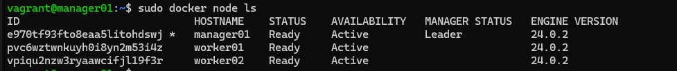

## Part 1. Запуск нескольких docker-контейнеров с использованием docker compose.

1) Для каждого сервиса напишем свой докер файл, который будет выполнять установку зависимостей проекта в отдельном контейнере, далее копировать исходный код проекта в новый контейнер и собирать проект.
2) Итого у нас получается 9 сервисов:
    1) База данных postgres.
    2) Очередь сообщений rabbitmq.
    3) Session service - сервис управляющий сессиями пользователей.
    4) Hotel service - сервис управляющий сущностью отелей.
    5) Payment service - сервис управляющий оплатой.
    6) Loyalty service - сервис управляющий программой лояльности.
    7) Report service - сервис осуществляющий сбор статистики.
    8) Booking service - сервис управляющий резервированием.
    9) Gateway service - фасад для взаимодействия с остальными микросервисами  

3) С помощью команд ```docker images```  или ```docker-compose images```  проверяем все образы и их размеры.


4) Напишем docker-compose файл, который осуществляет корректное взаимодействие сервисов. С помощью команд ```docker-compose build``` и ```docker-compose up``` соберем и запустим наши контейнеры.  
 

5) Прогоним тесты через Postman и убедимся что все они проходят успешно.  


## Part 2. Создание виртуальных машин.

1) Проблемы с которыми я столкнулся при исользовании vagrant на WSL2:  
    1) Для работы vagrant нужны 3 утилиты:  vagrant, virtualbox, docker swarm. 
    2) При установке virtualbox у нас возникают ошибки:  
    
    3) Мои попытки узнать что это за ошибка и как её устранить привели меня к тому что версия ядра ```5.15.146.1-microsoft-standard-WSL2``` не поддерживается virtualbox, точнее нет заголовков ядра для данной версии, и соответственно virtualbox не может нормально функционировать без них.
      
    4) При попытке запуска vagrant, соответственно будет ошибка, т.к., он не нашёл провайдер virtualbox. Пакет ```virtualbox-dkms``` проверяет как раз таки ядро и его доступность.  
    
    5) Далее я пошёл в интернет, дабы выяснить что не так и как это исправить, наткнулся на официальную [документацию](https://developer.hashicorp.com/vagrant/docs/other/wsl).
    6) Выяснил я следующее: на WSL2 vagrant нормально работать не будет, у меня было два пути переносить весь проект в виртуальную машину(виртуализация внутри виртуализации не самая лучшая идея) или делать всё на Windows, я решил сделать всё на Windows. 

2) Устанавливаем vagrant на Windows.  
    
    1) Напишем Vagrantfile для создания виртуальной машины и переноса исходного веб-сервиса в рабочую директорию виртуальной машины.  
    
    2) Запустим машину командой ```vagrant up```.  
    
    3) Подключаемся к машине с помощью ```vagrant ssh``` и проверяем что исходный код встал куда нужно.  
    
    4) Останавливаем машину ```vagrant halt``` проверяем что она остановлена ```vagrant status``` и уничтожаем ```vagrant destroy```.
    


## Part 3. Создание простейшего docker swarm.

1) Модифицируем Vagrantfile для создания трех машин: manager01, worker01, worker02.  
  

2) Напишем shell-скрипты для установки docker внутрь машин, инициализации и подключения к docker swarm.  
    1) Для менеджера  
    
    2) Для воркера  
    

3) Проверим что все 3 машины успешно запустились ```vagrant status```  
  

4) Подключаемся к нашему менеджеру ```vagrant ssh manager01``` и проверяем что всё успешно завершилось ```sudo docker node ls```  
  

5) Загрузим собранные образы на [docker hub](https://hub.docker.com/repository/docker/cubikone/school21/general) и модифицируем [docker-compose](/DevOps_7-1/src/docker-compose.yml) файл для подгрузки расположенных на docker hub образов. 

6) Перемести docker-compose файл внутрь manager01.    


7) Запустим стек сервисов, используя написанный docker-compose файл ```sudo docker stack deploy -c docker-compose.yml MyDeploy```.  

8) Проверяем состояние стек сервисов ```sudo docker stack services MyDeploy```


9) Так же, можно проверить логи сервиса ```sudo docker service logs %name_service%```  

10) Ещё можно посмотреть распределение статистики сервиса ```sudo docker service ps %name_service%```  

11) ```sudo docker stack ps MyDeploy``` покажет состояние стека сервисов.  


12) Настроим прокси на базе nginx для доступа к gateway service и session service по оверлейной сети. Сами gateway service и session service сделать недоступными напрямую. И так же грузим данный образ на докер-хаб.   
    1) Для этого нам нужно сделать ещё один [контейнер](/DevOps_7-1/src/services/nginx-service/Dockerfile) на базе nginx и написать конфиги для него.  
    
    

13) Прогоним заготовленные тесты через postman и удостоверимся, что все они проходят успешно.  


14) Используя команды docker, отобразим в отчете распределение контейнеров по узлам. ```sudo docker node ls``` и ```sudo docker stack ps MyDeploy```  


15) Создадим [файл](/home/cubikone/sc21/DevOps_7-1/src/portainer-stack.yml) для настройки portainer.

16) Запустим стек portainer ```sudo docker stack deploy -c portainer-stack.yml portainer```   


17) Получим доступ по [адресу](http://192.168.50.10:9000) для входа в portainer.  


18) Отобразятся наши сервисы.


19) Получим визуализацию распределения задач по узлам.

